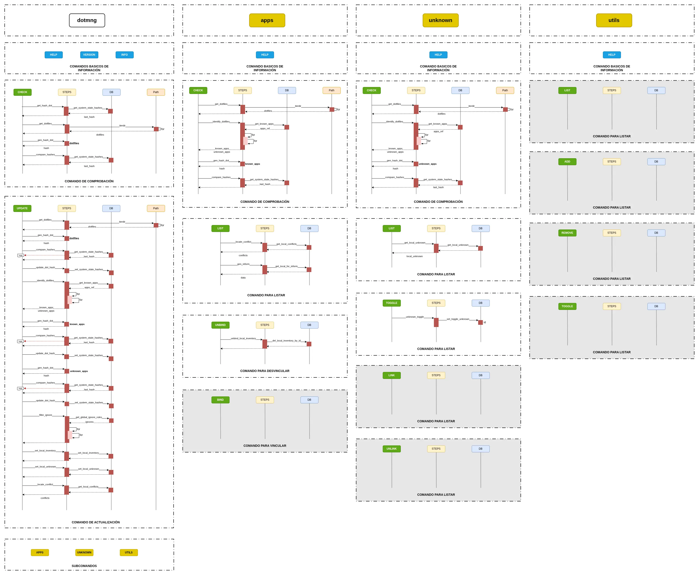

El cliente sigue una estructura modular para separar la lógica de negocio de la interfaz de usuario.

A continuación se presenta la estructura física de directorios del código fuente bajo `src/dotmng/`, representando de forma fiel los módulos del proyecto actual:

```text
src/dotmng/
├── cli/
│   ├── commands.py         # Controladores de comandos (check, update, bind)
│   ├── console.py          # Inicialización de consola Rich
│   ├── create.py           # Creador y configurador de argumentos
│   ├── customs.py          # Vistas y menús personalizados interactivos
│   ├── parser.py           # Orquestador del parseo de argumentos de CLI
│   └── printer.py          # Renderizador avanzado de tablas y reportes con Rich
│
├── core/
│   ├── context.py          # Almacenamiento de estado durante la ejecución del pipeline
│   ├── pipelines.py        # Orquestador secuencial del motor de tareas
│   ├── reporter.py         # Adaptador y despachador de eventos (CLI vs GUI)
│   └── steps.py            # Definición de pasos granulares del pipeline (auditoría, etc.)
│
├── modules/
│   ├── api/
│   │   ├── client.py       # AppClient: interfaz de llamadas HTTP a /discovery
│   │   └── poller.py       # ServerPoller y TaskPoller (QThread) para sondeo asíncrono
│   │
│   ├── database/
│   │   ├── manager.py      # Gestor transaccional SQLite
│   │   └── models.py       # Definición de modelos ORM SQLAlchemy
│   │
│   └── logger.py           # Sistema de logging rotativo y consola
│
├── ui/
│   ├── forms/              # Diseños visuales en formato .ui (Qt Designer)
│   ├── interface/          # Archivos de interfaz autogenerados en Python
│   ├── styles/             # Hojas de estilo personalizadas QSS (diseño premium)
│   ├── widgets/            # Componentes y listas personalizadas Qt
│   │
│   ├── actions.py          # Rutinas del sistema (hostname, distro, hashes de disco)
│   ├── first_run_dialog.py # Diálogo guiado de primera configuración
│   ├── handler.py          # Canalizador seguro de hilos y eventos QT (QObject)
│   ├── load_screen.py      # Pantalla de carga (Splash screen animada)
│   ├── main_window.py      # Ventana principal y dashboard del cliente
│   └── worker.py           # Trabajador en segundo plano (QThread) para el motor de pipelines
│
├── config.py               # Configuración global de rutas y variables de entorno
├── version.py              # Metadatos de la versión del cliente
└── main.py                 # Punto de entrada de la aplicación
```

### Módulos Core

* **`core/pipelines.py`:** Orquestador principal que define la secuencia de ejecución de los comandos (check, update, bind).
* **`core/steps.py`:** Definición de los pasos individuales que componen un pipeline (escaneo, comparación de hashes, guardado).
* **`core/context.py`:** Objeto que mantiene el estado global durante la ejecución de un comando.
* **`core/reporter.py`:** Utilidad para la generación de reportes de ejecución. Actúa como adaptador de salida centralizado para aislar la lógica del entorno (CLI vs UI).

  *Ejemplo de uso del Reporter:*

  ```python
  # Paso Genérico (Lógica):
  context.reporter.send("comparando_hashes", context)

  # Despachador resuelve y emite el evento al entorno correspondiente:
  sender = UI_Handler()  # En entorno gráfico
  sender.comparando_hashes(context)  # → emite señal segura a la Ventana Qt
  ```

### Módulos de Soporte

* **`modules/database/`:** Contiene los modelos de SQLAlchemy y el gestor de la base de datos local SQLite.
* **`modules/logger.py`:** Sistema centralizado de trazas para depuración y auditoría.
* **`modules/api/`:** Lógica de comunicación con el servidor central. Contiene `AppClient` (envío de peticiones HTTP) y los hilos `ServerPoller` / `TaskPoller` (sondeo periódico del estado de las tareas vía QThread).

### Capas de Interfaz

* **`cli/`:** Implementación de la interfaz de línea de comandos mediante parsers de argumentos y formateo con Rich.
* **`ui/`:** Implementación de la interfaz gráfica (PySide6). Utiliza un sistema de hilos (`QThread`) para evitar que las operaciones pesadas bloqueen la ventana principal.

### Flujo de Ejecución de Comandos

El comportamiento dinámico y las interacciones secuenciales entre estos componentes (por ejemplo, al ejecutar un comando a través de los hilos seguros de Qt) se detallan en el siguiente diagrama de secuencia:

<div align="center">
  <a href="../../assets/DiagramaSecuencia.webp" target="_blank">
    
  </a>
</div>


---