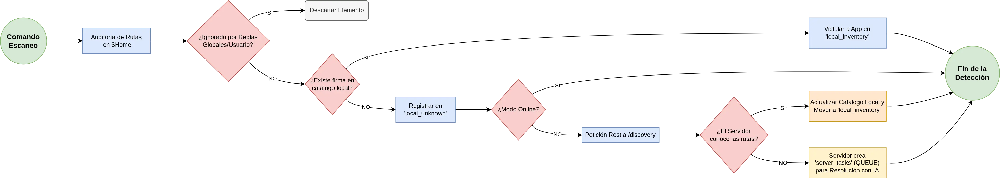

El motor de detección es el corazón técnico del cliente. Utiliza un patrón de diseño **Pipeline** (tubería) para procesar el sistema de archivos de forma secuencial y eficiente.

### El Pipeline de Auditoría

 

  

Cada vez que se inicia un escaneo (comando `check` o `update`), los archivos atraviesan las siguientes etapas:

1. **Descubrimiento:** El sistema itera sobre el $HOME buscando archivos y directorios ocultos (aquellos que comienzan por punto o residen en `~/.config`).
2. **Filtrado de Ignorados:** Se aplica la capa de ignorados de forma temprana para eliminar de la lista aquellos archivos que coinciden con patrones de basura o reglas de exclusión (ej: `*.log`, `*.tmp`, `cache/`), evitando gastar recursos innecesarios.
3. **Validación de Estado:** Se calcula el hash de los archivos restantes y se consulta `system_state_hashes` para ver si el directorio o archivo ha cambiado desde el último escaneo.
4. **Heurística XDG:** Se aplican reglas basadas en el estándar XDG para identificar aplicaciones comunes.
5. **Clasificación:** Se asigna una aplicación y categoría a cada ruta validada.

### Optimización mediante Hashes

Para evitar cuellos de botella en discos mecánicos o directorios $HOME muy extensos, el sistema no lee el contenido de todos los archivos. En su lugar, calcula un hash de la estructura del directorio (nombres de archivos y fechas de modificación) para determinar en milisegundos si es necesario profundizar en el análisis de ese nodo.

---