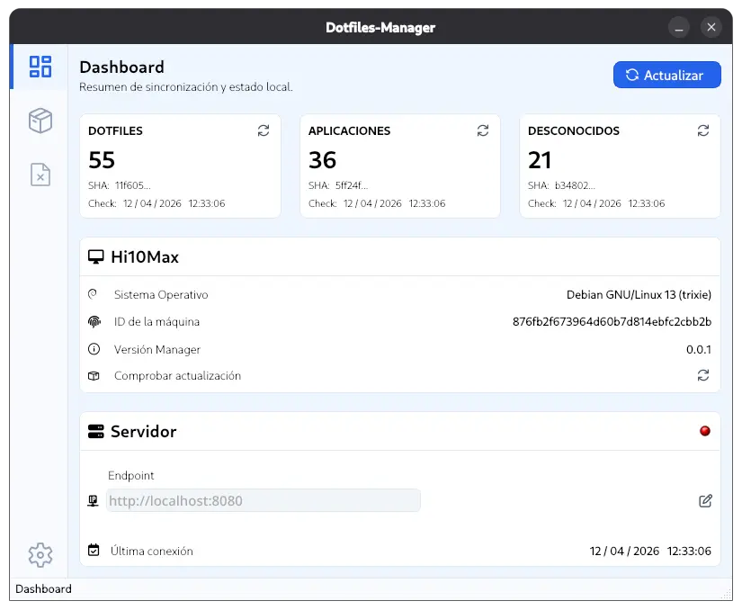
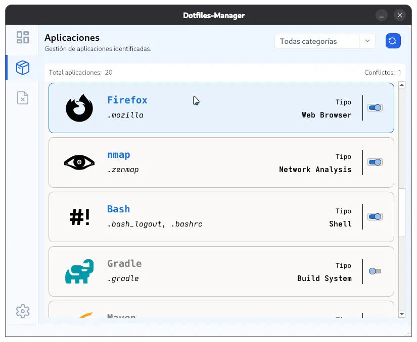
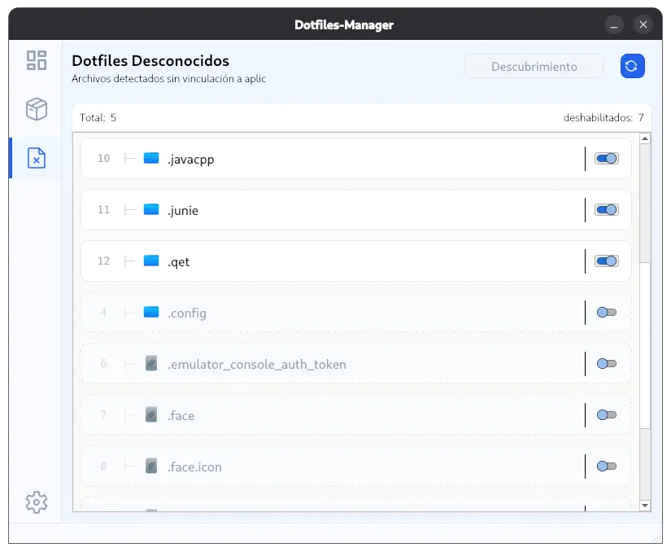
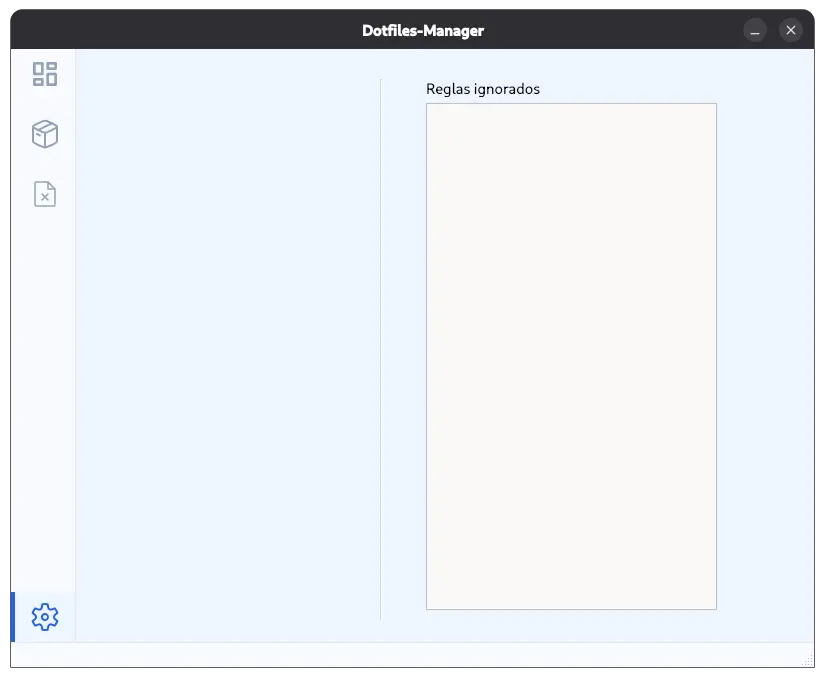
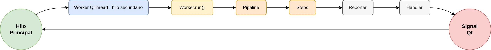

**Dotfiles-Manager** ofrece una experiencia versátil mediante dos interfaces que comparten el mismo núcleo lógico (Core), permitiendo al usuario elegir la que mejor se adapte a su flujo de trabajo.

### Interfaz de Línea de Comandos (CLI)

Diseñada para la eficiencia y la automatización, la CLI utiliza el binario `dotmng` y proporciona:

* **Comandos claros:** `check`, `update`, `bind`, `list`.
* **Salida visual:** Formateo avanzado con la librería **Rich** para tablas de estado, barras de progreso y colores descriptivos.
* **Integración:** Fácilmente integrable en scripts de sistema y tareas programadas.

### Interfaz Gráfica (UI)

Desarrollada con **PySide6**, la GUI ofrece una gestión visual del entorno. A continuación se muestran diversas capturas del dashboard del sistema que demuestran su diseño y capacidades:

<table style="border: none;">
  <tr style="border: none;">
    <td align="center" style="width: 50%; border: none; padding: 15px; vertical-align: top;">
      
      
<i>Vista principal del sistema, mostrando el estado general.</i>

    </td>
    <td align="center" style="width: 50%; border: none; padding: 15px; vertical-align: top;">
      
      
<i>Explorador visual para la gestión y vinculación de dotfiles.</i>

    </td>
  </tr>
  <tr style="border: none;">
    <td align="center" style="width: 50%; border: none; padding: 15px; vertical-align: top;">
      
      
<i>Vista detallada de la gestión de tareas o resolución de conflictos.</i>

    </td>
    <td align="center" style="width: 50%; border: none; padding: 15px; vertical-align: top;">
      
      
<i>Interfaz secundaria de configuración o listado extendido.</i>

    </td>
  </tr>
</table>

Las características clave de esta interfaz incluyen:

* **Dashboard:** Vista general del estado de protección de los dotfiles.
* **Gestión de Inventario:** Explorador visual para vincular rutas a aplicaciones.
* **Resolución de Conflictos:** Notificaciones visuales cuando un archivo ha cambiado y requiere un commit.
* **Asistente de Servidor:** Interfaz dedicada para ver el progreso de la clasificación de archivos desconocidos por parte del servidor.

**Ejecución en Hilo Independiente (QThread):**
Para evitar que la interfaz gráfica se congele durante el procesamiento de datos pesados (cálculo de hashes, escaneo de disco, red), el núcleo lógico se aísla mediante hilos:

  

### Diseño y Usabilidad (UX)

Ambas interfaces siguen el patrón **Modelo-Vista-Controlador (MVC)**, asegurando que la visualización siempre sea coherente con el estado real de la base de datos SQLite.

---