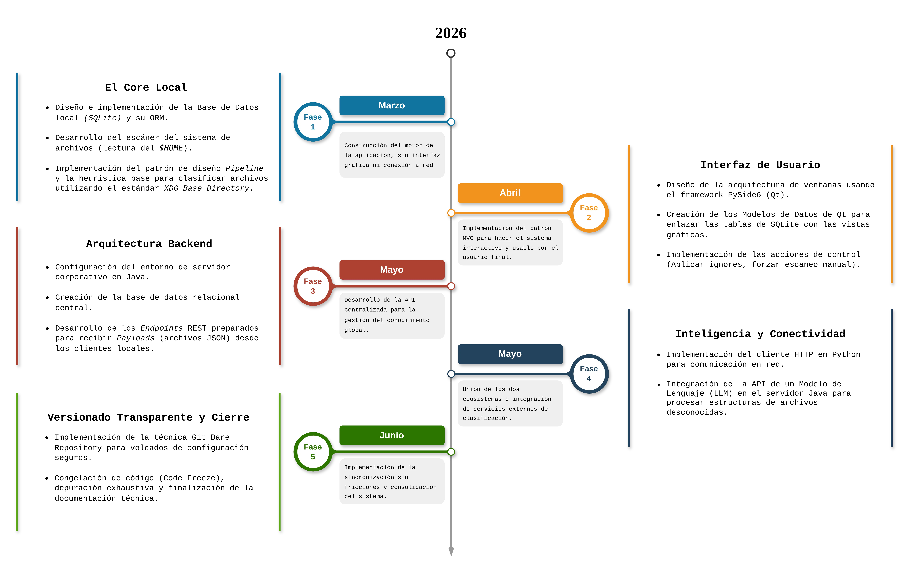

Para garantizar el éxito del proyecto y la entrega de un Producto Mínimo Viable (MVP) funcional, el desarrollo se ha estructurado en fases incrementales. Esta secuenciación permite asegurar la estabilidad de los componentes críticos antes de añadir funcionalidades superiores.

  

## Fases de desarrollo

1. **Fase de Análisis y Diseño (Marzo):** Estudio de requisitos, diseño de esquemas de bases de datos y prototipado de la interfaz.
2. **Fase de Desarrollo del Cliente (Abril):** Implementación del motor de auditoría en Python, integración de SQLite y lógica de Git Bare.
3. **Fase de Desarrollo del Servidor (Mayo):** Creación de la API REST con Spring Boot y el servicio de procesamiento de tareas.
4. **Fase de Integración de IA (Mayo - Junio):** Conexión con la API de Google Gemini y pruebas de clasificación heurística.
5. **Fase de Validación y Documentación (Junio):** Pruebas de integración cliente-servidor y redacción de la memoria final.

## Hitos principales

* **Hito 1:** Motor de escaneo local funcional.
* **Hito 2:** Persistencia local y control de versiones con Git Bare operativo.
* **Hito 3:** Comunicación exitosa entre el cliente Python y el servidor Java.
* **Hito 4:** Resolución de archivos desconocidos mediante IA.
* **Hito 5:** Interfaz gráfica consolidada.

---